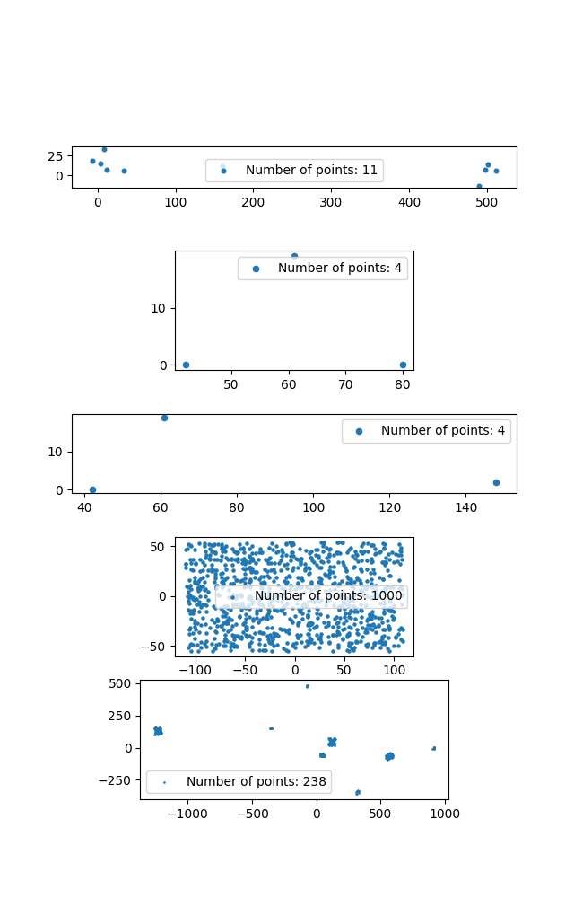

### 1. Dead Мороз
Считываем данные из файлов:
```Python
dm1 = [i.strip() for i in open('dead_moroz/001.dat').readlines()]
n1 = int(dm1[0])
dm2 = [i.strip() for i in open('dead_moroz/002.dat').readlines()]
n2 = int(dm2[0])
dm3 = [i.strip() for i in open('dead_moroz/003.dat').readlines()]
n3 = int(dm3[0])
dm4 = [i.strip() for i in open('dead_moroz/004.dat').readlines()]
n4 = int(dm4[0])
dm5 = [i.strip() for i in open('dead_moroz/005.dat').readlines()]
n5 = int(dm5[0])
```

Строим точки с помощью `scatter`:
```Python
fig1, axs1 = plt.subplots(nrows=5, ncols=1)
axs1[0].scatter([float(i.split()[0]) for i in dm1[1:n1]], [float(i.split()[1]) for i in dm1[1:n1]])
axs1[0].set_title('Number of points: ' + str(n1))
axs1[1].scatter([float(i.split()[0]) for i in dm2[1:n2]], [float(i.split()[1]) for i in dm2[1:n2]])
axs1[1].set_title('Number of points: ' + str(n2))
axs1[2].scatter([float(i.split()[0]) for i in dm3[1:n3]], [float(i.split()[1]) for i in dm3[1:n3]])
axs1[2].set_title('Number of points: ' + str(n3))
axs1[3].scatter([float(i.split()[0]) for i in dm4[1:n4]], [float(i.split()[1]) for i in dm4[1:n4]])
axs1[3].set_title('Number of points: ' + str(n4))
axs1[4].scatter([float(i.split()[0]) for i in dm5[1:n5]], [float(i.split()[1]) for i in dm5[1:n5]])
axs1[4].set_title('Number of points: ' + str(n5))
plt.show()
```

Получаем такие графики:

