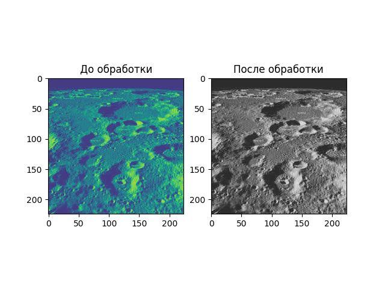
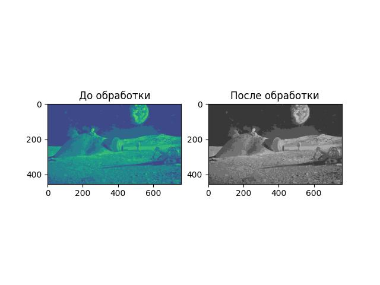

## Эпизод 1
У вас есть картинки поверхности Луны. Они чёрно-белые, и это нормально - такая была камера. К сожалению, качество их не очень - контраст страдает, вместо честных градаций от чёрного до белого камера зафиксировала 42 оттенка серого. Давайте улучшим картинки, чтобы они более внятно воспринимались глазом.

### Задача - переинтерполировать картинки, использовав весь доступный диапазон для улучшения контраста. Логика преобразования такая:

* чёрно-белая картинка - это по сути простой 2D-массив, каждый элемент которого представляет собой 1 пиксель картинки (с цветными всё несколько сложнее),
* каждый пиксель может иметь значения от 0 до 255,
* реально у нас на этих нерезких картинках все пиксели находятся где-то внутри небольшого диапазона значений (условно, от 10 до 50 вместо полного спектра),
* поэтому нужно считать картинку и аккуратно линейно "растянуть" диапазон, минимальное значение на исходной картинки должно получить значение 0 в выходном изображении, а максимальное на исходной - 255 на выходе.

```Python
import os
import numpy as np
from PIL import Image
import matplotlib.pyplot as plt


def func(x, minn, maxx):
    return (x - minn) * 255 / (maxx - minn)


path = 'lunar_images'
os.chdir(path)
for im in os.listdir():
    img = Image.open(im)
    plt.imshow(img)
    data = np.array(img)
    maxx = data.max()
    minn = data.min()
    new_data = []
    for i in range(data.shape[0]):
        ar = []
        for j in range(data.shape[1]):
            ar.append(func(data[i][j], minn, maxx))
        new_data.append(ar)
    res_img = Image.fromarray(np.array(new_data))
    fig, ax = plt.subplots(nrows=1, ncols=2)
    ax[0].imshow(img)
    ax[0].set_title('До обработки')
    ax[1].imshow(res_img)
    ax[1].set_title('После обработки')
    plt.savefig('new_'+str(im))
    plt.show()
```

Получаем такие новые изображения:





