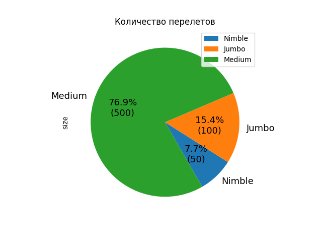
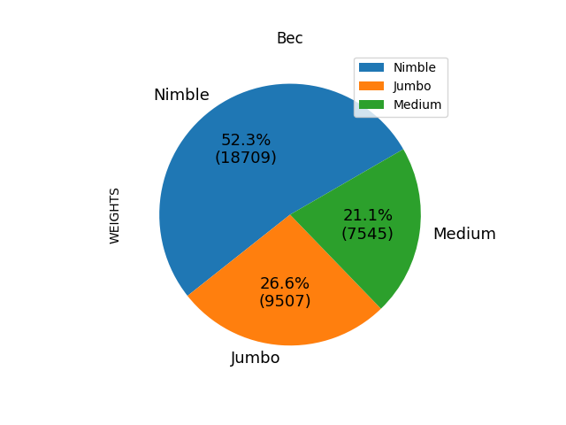

## Эпизод 1
В наши руки попали данные о платежах некоторой глубоко законспирированной организации.
Судя по всему, поля в данных следует воспринимать предельно просто: CONTRACTOR - кому платёж, STATUS - статус операции, SUM - сумма операции. 

### Задача 1: найти 3 самых крупных платежа из реально проведённых (статус OK).
```Python
import pandas as pd

transactions = pd.read_csv('transactions.csv', delimiter=',')
print(transactions[transactions['STATUS'] == 'OK'].sort_values(by='SUM').drop_duplicates('SUM').loc[:, 'SUM'][-3:])
```

Вывод программы(второй столбец соотвествует трём максимальным выплатам):
```
3947       999
4451      1000
5085    100500
```

### Задача 2: определить полную сумму реально проведённых платежей в адрес Umbrella, Inc.
```Python
print(transactions[transactions['STATUS'] == 'OK'][transactions['CONTRACTOR'] == 'Umbrella, Inc']['SUM'].sum())
```

Вывод программы(полная сумма платежей для Umbrella, Inc):
```
925719
```


## Эпизод 2
У нас есть набор данных о грузовых рейсах - вот он. Поля в данных: CARGO - авиакомпания, PRICE - стоимость груза на борту, WEIGHT - масса груза на борту.

### Задача: посчитать, сколько рейсов выполнила каждая авиакомпания, полную стоимость и полную массу перевезённых ей грузов. Построить график уместного вида с результатами.
```Python
import numpy as np

def func(pct, allvals):
    absolute = int(np.round(pct / 100. * np.sum(allvals)))
    return f"{pct:.1f}%\n({absolute:d})"


flights = pd.read_csv('flights.csv', delimiter=',')
s = flights.groupby(flights.loc[:, 'CARGO'], as_index=False).size().loc[:, 'size']
siz = [s[0], s[1], s[2]]
flights.groupby(flights.loc[:, 'CARGO'], as_index=False).size().plot.pie(y='size',
                                                                         labels=flights.loc[:,
                                                                                'CARGO'].drop_duplicates(),
                                                                         autopct=lambda pct: func(pct, siz),
                                                                         startangle=300, fontsize=13,
                                                                         title='Количество перелетов')
plt.savefig('pd1_1.png')
plt.show()
price_Jumbo = flights[flights['CARGO'] == 'Jumbo'].loc[:, 'PRICE'].sum()
price_Medium = flights[flights['CARGO'] == 'Medium'].loc[:, 'PRICE'].sum()
price_Numble = flights[flights['CARGO'] == 'Nimble'].loc[:, 'PRICE'].sum()
pric = [price_Jumbo, price_Medium, price_Numble]
pd.DataFrame({'PRICES': [price_Jumbo, price_Medium, price_Numble]}).plot.pie(y='PRICES',
                                                                             labels=flights.loc[:,
                                                                                    'CARGO'].drop_duplicates(),
                                                                             autopct=lambda pct: func(pct, pric),
                                                                             startangle=300,
                                                                             fontsize=11,
                                                                             title='Стоимость')
plt.savefig('pd1_2.png')
plt.show()
weight_Jumbo = flights[flights['CARGO'] == 'Jumbo'].loc[:, 'WEIGHT'].sum()
weight_Medium = flights[flights['CARGO'] == 'Medium'].loc[:, 'WEIGHT'].sum()
weight_Numble = flights[flights['CARGO'] == 'Nimble'].loc[:, 'WEIGHT'].sum()
weig = [weight_Jumbo, weight_Medium, weight_Numble]
pd.DataFrame({'WEIGHTS': [weight_Jumbo, weight_Medium, weight_Numble]}).plot.pie(y='WEIGHTS',
                                                                                 labels=flights.loc[:,
                                                                                        'CARGO'].drop_duplicates(),
                                                                                 autopct=lambda pct: func(pct, weig),
                                                                                 startangle=30,
                                                                                 fontsize=13,
                                                                                 title='Вес')
plt.savefig('pd1_3.png')
plt.show()
```

Графики:







## Эпизод 3
Однажды один факультет 1-го сентября 1-го курса писал входное тестирование по информатике. В архиве xlsx с данными групп от деканата и html-ная таблица результатов из ejudge. 

В xlsx-файле логины студентов (поле login), номера их факультетских групп (поле group_faculty), номера их групп после распределения на группы по информатике (поле group_out).

### Задание 1: построить графики среднего количества решённых задач (а) по факультетским группам, (б) по группам по информатике
```Python
info = pd.read_excel('students_info.xlsx').dropna()
results = pd.read_html('results_ejudge.html')[0]
info.columns = ['User', 'group_faculty', 'group_out']
data = pd.merge(results, info, on='User')

average_group = []
average_inf = []
for group in data.loc[:, 'group_faculty']:
    a = [group,
         round(data[data['group_faculty'] == group].loc[:, 'Solved'].sum() / data[data['group_faculty'] == group].loc[:,
                                                                             'User'].size, 2)]
    if a not in average_group:
        average_group.append(a)
for group in data.loc[:, 'group_out']:
    a = [group, round(
        data[data['group_out'] == group].loc[:, 'Solved'].sum() / data[data['group_out'] == group].loc[:, 'User'].size,
        2)]
    if a not in average_inf:
        average_inf.append(a)
x1 = [i[0] for i in average_group]
y1 = [i[1] for i in average_group]
plt.bar(x1, y1)
plt.grid()
plt.xlabel('group_faculty')
plt.ylabel('average solved')
for i in range(len(x1)):
    plt.text(x1[i], y1[i], y1[i], ha='center')
plt.savefig('pd3_1.png')
plt.show()
x2 = [i[0] for i in average_inf]
y2 = [i[1] for i in average_inf]
plt.bar(x2, y2)
plt.grid()
plt.xlabel('group_out')
plt.ylabel('average solved')
for i in range(len(x2)):
    plt.text(x2[i], y2[i], y2[i], ha='center')
plt.savefig('pd3_2.png')
plt.show()
```

Полученные графики:


### Задание 2: определить, из каких факультетских групп пришли и в какие группы по информатике попали люди, которые смогли пройти более одного теста в хотя бы одной из двух последних задач.(Задачи G и H в таблице, каждый тест даёт 10 баллов)
```Python
G = list(results['G'])
H = list(results['H'])
bests = []
for i in range(len(users)):
    if G[i] > 10 or H[i] > 10:
        bests.append(users[i])
for i in range(len(bests)):
    g1 = group_faculty[login.index(bests[i])]
    g2 = group_out[login.index(bests[i])]
    print('Студент', bests[i], 'из факультетской группы', g1, 'попал в группу по информатике', g2)
```

Вывод программы:
```
Студент r0300205 из факультетской группы 2 попал в группу по информатике 33
Студент r0300206 из факультетской группы 2 попал в группу по информатике 33
Студент r0300508 из факультетской группы 5 попал в группу по информатике 33
Студент r0300314 из факультетской группы 3 попал в группу по информатике 33
Студент r0300209 из факультетской группы 2 попал в группу по информатике 33
Студент r0300514 из факультетской группы 5 попал в группу по информатике 33
Студент r0300414 из факультетской группы 4 попал в группу по информатике 33
Студент r0300511 из факультетской группы 5 попал в группу по информатике 35
Студент r0300212 из факультетской группы 2 попал в группу по информатике 36
Студент r0300301 из факультетской группы 3 попал в группу по информатике 35
Студент r0300515 из факультетской группы 5 попал в группу по информатике 35
```
