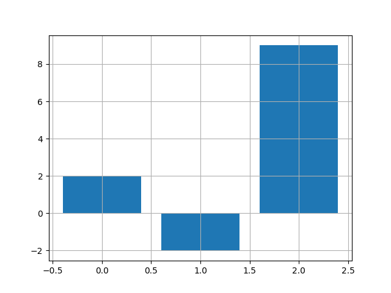
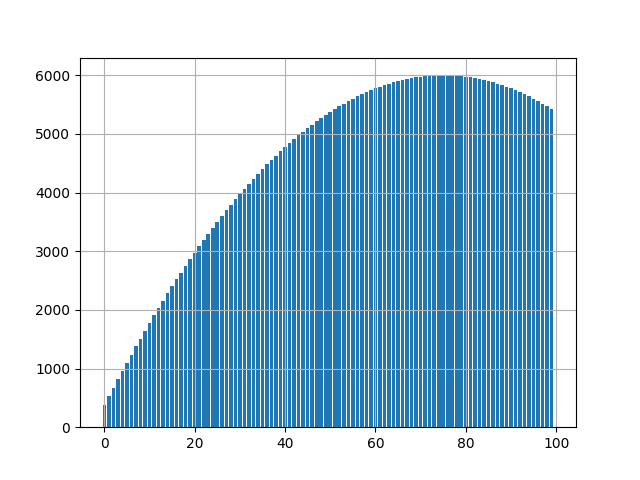
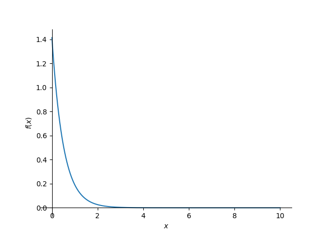
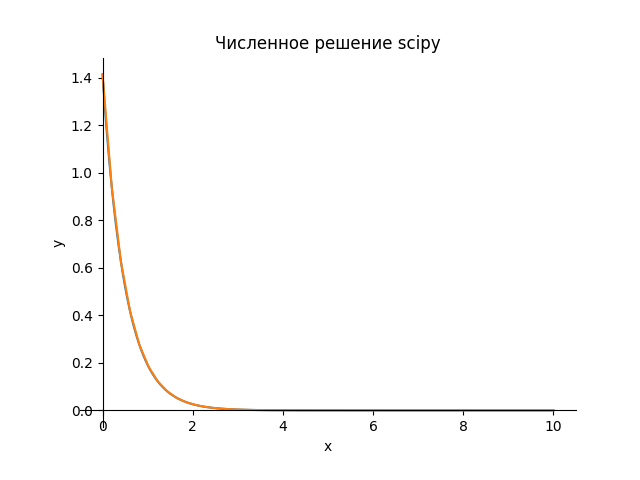

## Эпизод 1
Задана матрица 9х9:

$$\begin{bmatrix}0 & 0 & 0 & -\frac{1}{\rho} & 0 & 0 & 0 & 0 & 0 \\
0 & 0 & 0 & 0 & -\frac{1}{\rho} & 0 & 0 & 0 & 0 \\\
0 & 0 & 0 & 0 & 0 & -\frac{1}{\rho} & 0 & 0 & 0 \\\
-(\lambda + 2\mu) & 0 & 0 & 0 & 0 & 0 & 0 & 0 & 0 \\\
0 & -\mu & 0 & 0 & 0 & 0 & 0 & 0 & 0 \\\
0 & 0 & -\mu & 0 & 0 & 0 & 0 & 0 & 0 \\\
-\lambda & 0 & 0 & 0 & 0 & 0 & 0 & 0 & 0 \\\
0 & 0 & 0 & 0 & 0 & 0 & 0 & 0 & 0 \\\
-\lambda & 0 & 0 & 0 & 0 & 0 & 0 & 0 & 0\end{bmatrix}$$

Найдите её собственные значения в символьном виде:
```Python
import numpy as np
import sympy

ro = sympy.Symbol("ro")
l = sympy.Symbol("l")
m = sympy.Symbol("m")
z1 = np.zeros((3, 3))
nz1 = np.diag((-l-2*m, -m, -m))
nz2 = np.array([[-l, 0, 0], [0, 0, 0], [-l, 0, 0]])
matrix1 = np.concatenate((z1, nz1, nz2), axis=0)
nz3 = np.diag((-1/ro, -1/ro, -1/ro))
z2 = np.zeros((6, 3))
matrix2 = np.concatenate((nz3, z2), axis=0)
matrix3 = np.zeros((9, 3))
matrix = np.concatenate((matrix1, matrix2, matrix3), axis=1)

matrix = sympy.Matrix(matrix)
print('Собственные значения:', list(matrix.eigenvals().keys()))
```

Вывод программы:
```
Собственные значения: [-1.0*sqrt(m/ro), 1.0*sqrt(m/ro), -1.4142135623731*sqrt(0.5*l/ro + m/ro), 1.4142135623731*sqrt(0.5*l/ro + m/ro), 0]
```

То есть полученные собственные значения: $-\sqrt{\frac{\mu}{\rho}}$, $\sqrt{\frac{\mu}{\rho}}$, $-\sqrt{2}\sqrt{0.5\frac{\lambda}{\rho} + \frac{\mu}{\rho}}$, $\sqrt{2}\sqrt{0.5\frac{\lambda}{\rho} + \frac{\mu}{\rho}}$


## Эпизод 2
В файле задана система линейных уравнений вида Ax = b. Формат файла: в первой строке N - размерность вектора неизвестных; далее N строк с N значений через пробел в каждой - матрица A; далее ещё одна строка с N значений через пробел - вектор b.

Решите эту систему, результат нарисуйте barchart-ом, где i-ый столбик - значение соответственного x[i].

Для маленькой системы
```
3
3 2 0
1 -1 0
0 5 1
2 4 -1
```

Получаем рещение СЛАУ: `[ 2. -2.  9.]` и график:



Для огромной системы:



```Python
import matplotlib.pyplot as plt
import numpy as np
from scipy.linalg import solve

file = open('small.txt', 'r').readlines()
n1 = int(file[0])
A1 = np.array([list(map(int, i.strip().split())) for i in file[1:-1]])
b1 = np.array(list(map(int, file[-1].split())))
x1 = solve(A1, b1)
print('Решение СЛАУ:', x1)
plt.bar([0, 1, 2], x1)
plt.grid()
plt.savefig('1.png')
plt.show()

big = open('large.txt', 'r').readlines()
n = int(big[0])
A = np.array([list(map(float, i.strip().split())) for i in big[1:-1]])
b = np.array(list(map(float, big[-1].split())))
x = solve(A, b)
print('Решение СЛАУ:', x)
plt.bar(np.arange(0, len(x)), x)
plt.grid()
plt.savefig('2.png')
plt.show()
```


## Эпизод 3
Задан дифур: $\frac{dy(x)}{dx} = -2y(x), y(0) = \sqrt(2)$

Решите его два раза - один раз символьно SymPy-ем, второй раз численно SciPy-ем.

Выведите решение, найденное SymPy-ем. Постройте графики: (1) обоих решений на отрезке [0; 10], (2) разности решений SymPy-ем и SciPy-ем на этом же отрезке.





```Python
x = sympy.symbols('x')
y = sympy.Function('y')
C1 = sympy.Symbol('C1')
equation = sympy.Eq(y(x).diff(x), -2 * y(x))
solution = sympy.dsolve(equation, ics={y(0): 2 ** 0.5})
print(solution.rhs)
plot1 = sympy.plot(show=False)
plot1.append(sympy.plot(solution.rhs, (x, 0, 10), title='Символьное решение sympy', ylabel='y')[0])
plot1.save('3.png')


def dydx(y, x):
    return -2 * y


x = np.linspace(0, 10)
y0 = 2 ** 0.5
y = scipy.integrate.odeint(dydx, y0, x)
plt.plot(x, y)
plt.title('Численное решение scipy')
plt.xlabel('x')
plt.ylabel('y')
plt.savefig('4.png')
plt.show()

```
